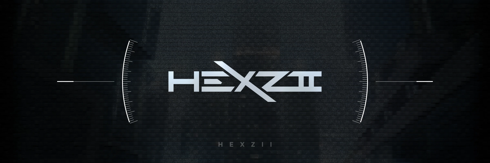

<p align="center">

</p>

## 👋 Hi There

🚀 This is Hexzii⭐!

🛜 I'm a full-stack developer, modder, and (unskilled) reverse engineer.

[🔑 GPG Public Key](https://github.com/hexadecimal233.gpg)

## 📱 Reach me

👉 Feel free to DM me! 👈

- Mail: [hexzii@nichijou.moe](mailto:hexzii@nichijou.moe)
- QQ: 2593828650
- Discord: hexadecimal233
- Telegram: @hexadecimal233 (less frequent)

## 📈 Stats


[](https://github.com/ryo-ma/github-profile-trophy)

## 🛠️ Developing tools and services

<!--See:https://github.com/hexadecimal233/homepage-new-->
<!--START_SECTION:skillicons-->

### 🛠️ Tools I mess with


### ⚙ Dev services & Devices


### 📦 Tech stack / Skill points


### ✨ Learning


<!--END_SECTION:skillicons-->

### ⏲️ WakaTime stats

<!--START_SECTION:waka-->

```txt
Other        21 hrs 37 mins  ██████████████████▒░░░░░░   72.85 %
Vue.js       4 hrs 49 mins   ████░░░░░░░░░░░░░░░░░░░░░   16.26 %
Python       1 hr 33 mins    █▒░░░░░░░░░░░░░░░░░░░░░░░   05.24 %
TypeScript   53 mins         ▓░░░░░░░░░░░░░░░░░░░░░░░░   03.01 %
TOML         16 mins         ▒░░░░░░░░░░░░░░░░░░░░░░░░   00.93 %
```

<!--END_SECTION:waka-->

<!--

### My projects

... TODO: Add projects?

-->

### 🎵 Other stats


<h3>Visitor Count：</h3>

