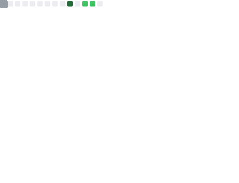

<p align="center">

<sub>logo by #MoRe</sub>
</p>

<div width=100% align=center>
  <h4>hush...!</h4>
  <a href="hhttps://nichijou.moe"><kbd>&nbsp;<br>&nbsp
  🏠 homepage
  &nbsp;<br>&nbsp;</kbd></a>
  <a href="https://github.com/hexadecimal233.gpg"><kbd>&nbsp;<br>&nbsp
  🔑 gpg public key
  &nbsp;<br>&nbsp;</kbd></a>
</div>

---

## 📈 stats

<div width=100% align=center>


<picture>
  <source media="(prefers-color-scheme: dark)" srcset="https://github-readme-stats-fast.vercel.app/api/top-langs/?username=hexadecimal233&theme=github_dark&layout=compact">
  <source media="(prefers-color-scheme: light)" srcset="https://github-readme-stats-fast.vercel.app/api/top-langs/?username=hexadecimal233&theme=default&layout=compact">
  
</picture>
</div>

<!-- TODO: Move to a better visualizer
[](https://github.com/ryo-ma/github-profile-trophy)
 -->
<!--START_SECTION:waka-->

```txt
Unknown   0 hrs 23 mins         ████████████░░░░░░░░░░░░░   48.41 %
Json      0 hrs 14 mins         ███████▒░░░░░░░░░░░░░░░░░   29.51 %
Bash      0 hrs 8 mins          ████▒░░░░░░░░░░░░░░░░░░░░   17.75 %
Nushell   0 hrs 1 mins          ▓░░░░░░░░░░░░░░░░░░░░░░░░   02.93 %
Nix       0 hrs 1 mins          ▒░░░░░░░░░░░░░░░░░░░░░░░░   01.40 %
```

<!--END_SECTION:waka-->

<!-- These are moved to my website

### 🎵 Other stats

 网易云风控搞的我疯狂掉登录

-->

<h3>visitor count：</h3>

